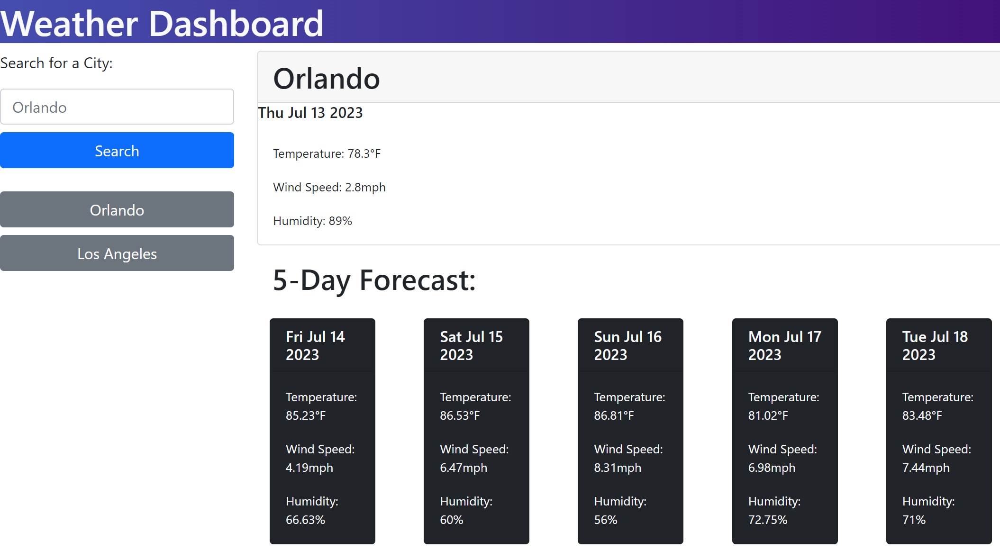

# Weather_Dashboard
Page for the weather outlook for multiple cities

## Description

Weather Dashboard webpage was created for UCF bootcamp class as a webpage to get weather information for the next 5 days. The webpage takes input of a city and displays weather information about said city. The webpage was designed to go along with learning and display student ability to utilize knowledge on JavaScript and APIs.

## Installation

N/A

## Usage

To use the Weather Dashboard page, load webpage and type in a city. Click the "Search" button to show weather data for the input city. The page will display the average temperature, wind speed, and humidity for the current day and the next 5 days.

Link to the webpage: [Work Day Scheduler]()

Screenshot with generated random password:

## Credits

Project idea provided by the boot camp creators [UCF Boot Camps](https://bootcamp.ce.ucf.edu/).

## License

Licensed under [MIT](LICENSE)
